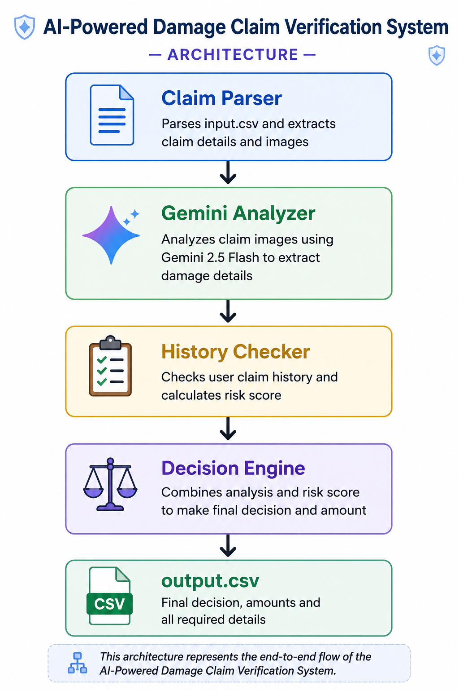

# 🚀 AI-Powered Damage Claim Verification System


> Built for HackerRank Orchestrate 2026 Hackathon

An AI-powered multimodal damage claim verification system that analyzes customer conversations, uploaded images, and user claim history to automatically verify damage claims and generate structured decisions.

---

## 💻 Tech Stack


---

## 🌟 Highlights

* 🤖 Gemini 2.5 Flash powered image analysis
* 🚗 Supports car damage verification
* 💻 Supports laptop damage verification
* 📦 Supports package damage verification
* ⚠️ Risk assessment using user history
* 📊 Automated CSV output generation
* 🛡️ Fallback handling for API failures
* 🏗️ Modular architecture for scalability

---

## 📌 Problem Statement

Manual claim verification is slow, expensive, and difficult to scale.

This project automates the first stage of claim review by combining:

* 🖼️ Image Analysis
* 💬 Claim Understanding
* ⚠️ Risk Assessment
* 🤖 AI-Powered Decision Making

Supported claim categories:

* 🚗 Cars
* 💻 Laptops
* 📦 Packages

---

## 🏗️ System Architecture



```text
Claims CSV
     ↓
Claim Parser
     ↓
Gemini Image Analyzer
     ↓
History Checker
     ↓
Decision Engine
     ↓
output.csv
```

---

## ✨ Features

* AI-powered image understanding using Gemini 2.5 Flash
* Claim extraction from customer conversations
* User risk analysis from historical claim data
* Structured claim verification
* Automated CSV output generation
* Fallback handling for API failures
* Modular and maintainable architecture

---

## 🛠️ Core Technologies

| Technology       | Purpose               |
| ---------------- | --------------------- |
| Python           | Core Development      |
| Gemini 2.5 Flash | Image & Text Analysis |
| Pandas           | CSV Processing        |
| Git              | Version Control       |
| GitHub           | Project Hosting       |

---

## 📂 Project Structure

```text
code/
├── main.py
├── image_analyzer.py
├── claim_parser.py
├── history_checker.py
├── decision_engine.py
├── csv_processor.py
└── evaluation/

dataset/
├── claims.csv
├── sample_claims.csv
├── user_history.csv

output.csv
```

---

## 🔄 Workflow

1. Load claim data from CSV.
2. Parse customer claim information.
3. Analyze uploaded images using Gemini.
4. Check user claim history.
5. Generate risk flags.
6. Build final claim decision.
7. Export results to output.csv.

---

## 📊 Output Fields

The generated output contains:

* evidence_standard_met
* evidence_standard_met_reason
* risk_flags
* issue_type
* object_part
* claim_status
* claim_status_justification
* severity

---

## 🚧 Challenges Faced

* Gemini API quota limitations
* Large-scale claim processing
* Output schema validation
* Time-constrained hackathon environment
* Handling multimodal image analysis reliably
* Managing AI service failures through fallback logic

---

## 📚 Key Learnings

* Multimodal AI Systems
* Prompt Engineering
* Gemini API Integration
* Software Architecture Design
* Real-World Debugging
* CSV Data Processing
* Git & GitHub Workflows
* Building Under Time Pressure

---

## 🔮 Future Improvements

* Multi-model fallback support (Gemini + Gemma)
* Better fraud detection
* Image quality validation
* Advanced claim scoring
* Production-ready deployment
* Dashboard for claim monitoring
* Cloud deployment and scalability

---

## 🏆 Hackathon Journey

* Participated in HackerRank Orchestrate 2026
* Built a complete end-to-end AI solution
* Generated final structured output for all claims
* Successfully submitted the solution
* Completed the AI Judge Interview

---

## 👨‍💻 Author

**Khuman Dhakad**

MCA Student | Aspiring Software Engineer

🔗 GitHub: https://github.com/khuman-dhakad

Built during HackerRank Orchestrate 2026 Hackathon 🚀
